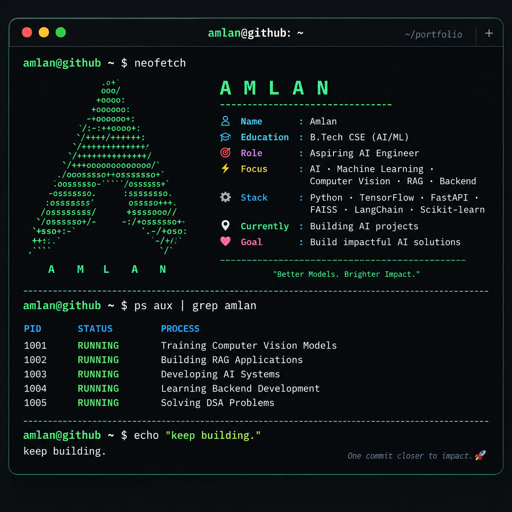

<div align="center">



# A M L A N MUKHERJEE

### B.Tech CSE (AI/ML) | Aspiring AI Engineer

Building practical AI systems with Machine Learning, Deep Learning, Computer Vision, RAG and Backend Development.

</div>

---

## `$ whoami`

```text
Name       : Amlan
Education  : B.Tech CSE (AI/ML)
Role       : Aspiring AI Engineer
Focus      : AI · Machine Learning · Computer Vision · Backend
Currently  : Building AI projects
$ ls ./projects
🧠 GI Disease Classification

Multi-model deep learning framework for GI disease image classification.

Tech: CNN Vision Transformer XGBoost Graph Attention Network

🏥 AI Healthcare Navigator

AI-powered healthcare assistant for prescription understanding and intelligent search.

Tech: OCR Information Extraction BM25 Semantic Search

🔎 AI Document Search

Semantic document search and question-answering system using Retrieval-Augmented Generation.

Tech: Sentence Transformers FAISS RAG FastAPI

💼 Career Assistant

AI-powered platform for resume analysis, skill extraction, job matching and interview preparation.

Tech: LangChain Gemini RAG FastAPI React ChromaDB NER

$ tech-stack

Languages

Python SQL Java

Machine Learning

TensorFlow Keras Scikit-learn Deep Learning

Computer Vision

CNN Vision Transformer OpenCV Image Classification

Generative AI

RAG LangChain Gemini FAISS BM25 Semantic Search

Backend

FastAPI REST APIs SQLite SQLAlchemy

Tools

Git GitHub VS Code

$ current_focus
[██████████████████░░] Deep Learning
[████████████████░░░░] Computer Vision
[███████████████░░░░░] RAG / LLM Systems
[██████████████░░░░░░] Backend Development
[████████████░░░░░░░░] System Design
[███████████░░░░░░░░░] DSA
$ ps aux | grep amlan
PID     STATUS      PROCESS

1001    RUNNING     GI Disease Classification
1002    RUNNING     AI Healthcare Navigator
1003    RUNNING     AI Document Search / RAG
1004    RUNNING     Career Assistant
1005    RUNNING     Learning System Design
$ connect
<div align="center"> <a href="https://github.com/amlan2005-droid">  </a> </div>
<div align="center">

amlan@github ~ $ echo "keep building."

🚀 Keep Building.
</div> 
